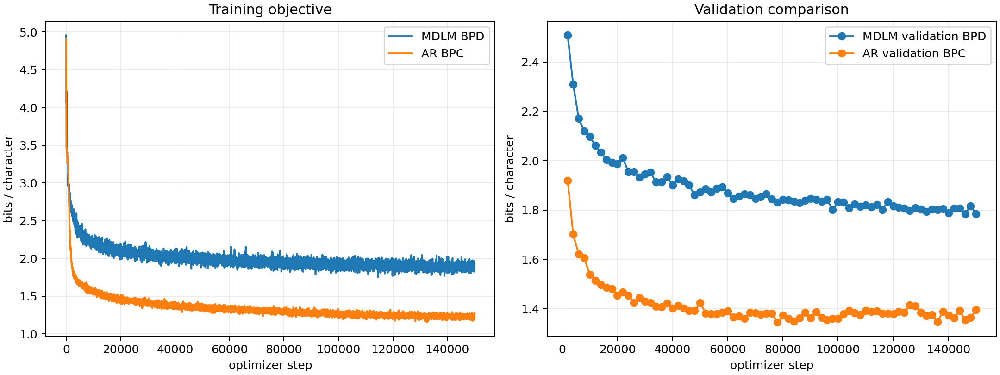
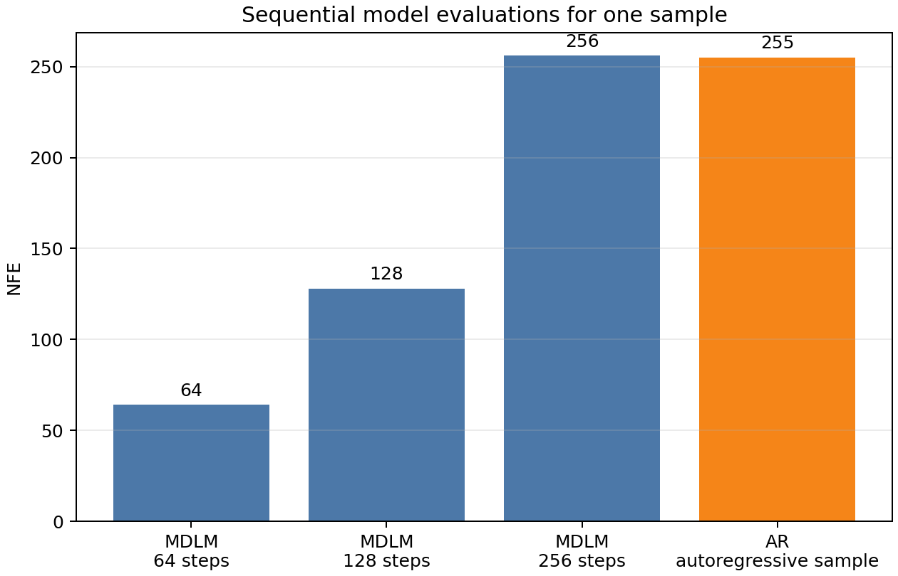

#  Simple and Effective Masked Diffusion Language Models (MDLM)

## Text8 experiment

`experiments/train_text8.py` trains a character-level MDLM and a matched-size
causal Transformer (AR) baseline on Text8. The script downloads and splits the
data 90%/5%/5%; it uses 27 character tokens plus one MDLM mask token. The
recommended AR width of 448 (7 heads) closely matches the default MDLM's
parameter count (about 19M each); all parameter counts are included in the
report.

On a 12 GB GPU, run:

```bash
python experiments/train_text8.py --device cuda --steps 150000 \
  --batch-size 64 --grad-accum 2 --precision bf16 \
  --ar-hidden-size 448 --ar-num-heads 7
tensorboard --logdir runs
python experiments/summarize_text8.py --run-dir runs/text8/default
```

Outputs are written to `runs/text8/default/`:

- TensorBoard: training loss, validation MDLM BPD, and validation AR BPC;
- `samples_step_*.txt`: MDLM samples for 64/128/256 reverse steps and AR samples;
- `report.json`: validation metric, parameter counts, and sampling NFE;
- `learning_curves.png`, `sampling_nfe.png`, and `summary.md`: static report;
- `checkpoint.pt`: both model weights and training configuration.

The validation BPD is a likelihood estimate for the MDLM, so it does not vary
with the sampling-step count. The 64/128/256 comparison measures generated text
and NFE; `report.json` repeats the same validation BPD in each row to make this
explicit. The AR comparison uses teacher-forced BPC and requires 255 sequential
model calls for a 256-character sample, but now caches the K/V tensors of every
layer: after the one-token prefix prefill, each call processes only one new token.
MDLM needs 64, 128, or 256 full-sequence calls respectively.

## Final Text8 results

The following is the completed run in `runs/text8/rtx3060_rope_ema_150k/` on
one RTX 3060 (12 GB). Both models were trained for 150,000 optimizer updates on
the standard character-level Text8 split (90%/5%/5%), with 256-character
contexts and global batch size 128. The MDLM is an 8-layer, width-384 DiT with
RoPE, dropout 0.1, sigma conditioning, and EMA (decay 0.9999); the AR baseline
is an 8-layer, width-448 causal Transformer with KV-cache generation.

| Model | Parameters | Validation metric | Result |
| --- | ---: | --- | ---: |
| MDLM (EMA) | 20.11M | BPD | **1.7844** |
| AR Transformer | 19.45M | BPC | **1.3965** |



`BPD` is the MDLM variational likelihood estimate in bits per character, while
the AR `BPC` is teacher-forced next-character cross entropy in bits per
character. They are useful learning curves, but are not a perfectly
like-for-like likelihood comparison because the MDLM value includes its
diffusion/ELBO estimator.

The MDLM's per-noise-interval validation BPD is shown below. The higher loss at
large `t` is expected: more characters have been replaced by the absorbing mask
and must be reconstructed from less context.

| Noise time `t` | `[0, .25]` | `[.25, .5]` | `[.5, .75]` | `[.75, 1]` |
| --- | ---: | ---: | ---: | ---: |
| MDLM validation BPD | 0.3467 | 0.9918 | 2.1947 | 3.6186 |

### Sampling cost and qualitative output

| Sampler | Reverse steps / NFE | Validation BPD |
| --- | ---: | ---: |
| MDLM | 64 | 1.7844 |
| MDLM | 128 | 1.7844 |
| MDLM | 256 | 1.7844 |
| AR (KV cache) | 255 | — |



The validation BPD is independent of the reverse-sampling discretization, so
the three MDLM rows intentionally report the same value. Sampling at 64 steps
uses one quarter of the model evaluations of the 256-step sampler, and about
one quarter of the AR sample's sequential forward passes. KV cache makes each
AR decode after the prefix prefill operate on one new token, but it does not
change its 255 sequential decoding steps.


## References

https://arxiv.org/pdf/2406.07524
